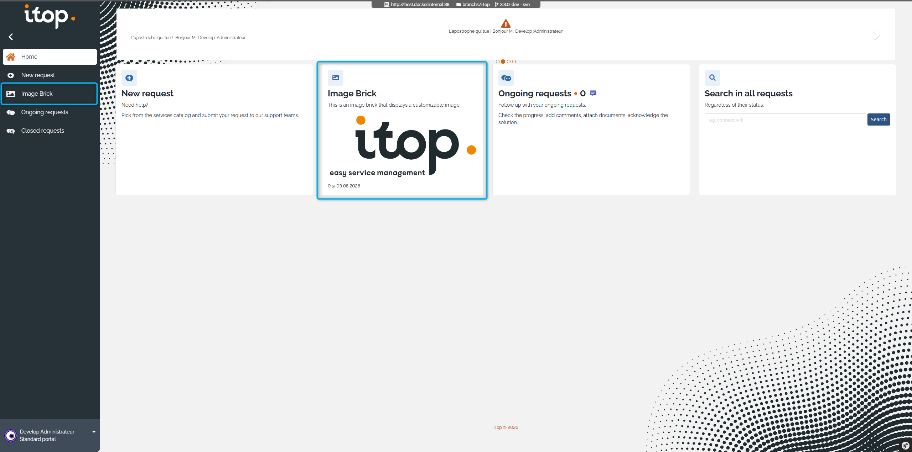
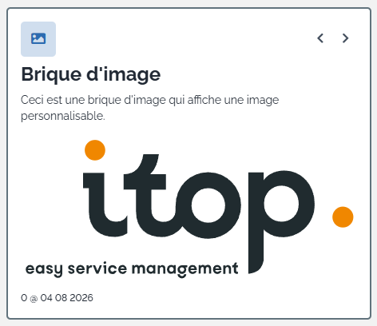
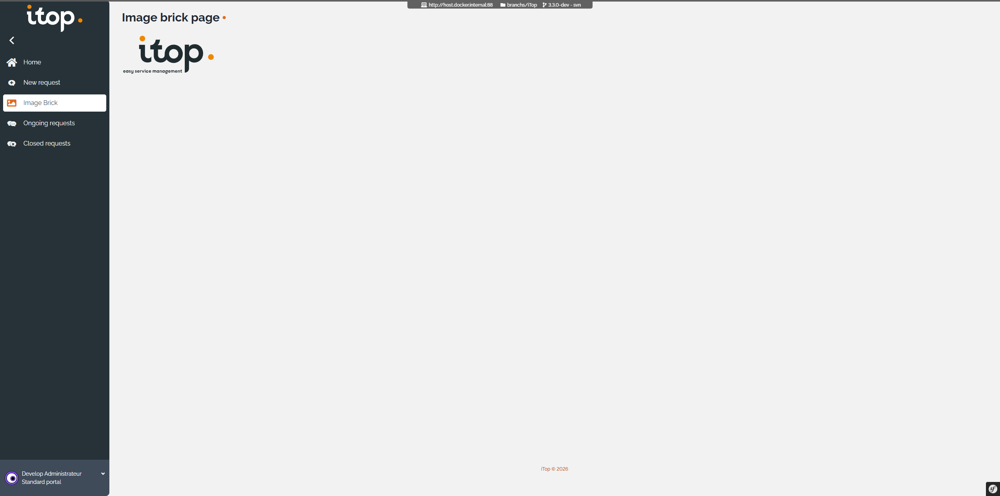
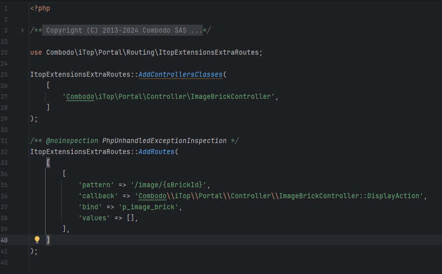
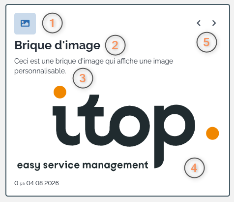
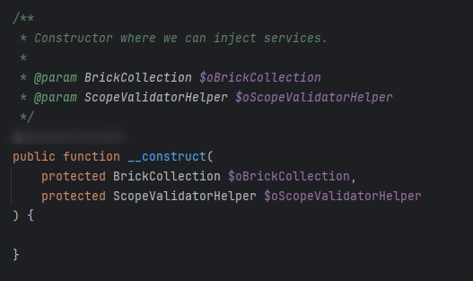
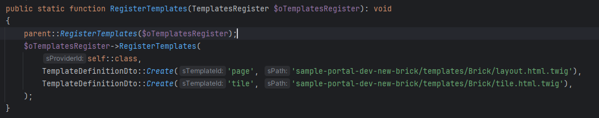

# Sample portal dev new brick

Sample to show which files are necessary to create a new brick for the portal.\
This sample declare a new kind of brick that display an image.

## Home Page

## Tile

The brick tile is the content displayed in the portal home page.\
The tile is a link to the brick page.

## Page

The brick page is the content displayed when clicking on the tile.

## 3.3 Consideration

New coding guidelines have been introduced in iTop 3.3, this sample is following those guidelines.

### Router

A router PHP file must be declared in the module.<extension>.php file to handle the brick.\
This file allow registration of controller classes and routes.

### Tile Template

1. **pTileDecoration** decoration of the brick usually used to display an image, but can be used to display any HTML content.
2. **pTileTitle** title of the brick
3. **pTileDescription** description of the brick
4. **pTileExtraContent** extra content of the brick, can be used to display any HTML content.
5. **pTileActions** actions of the brick, usually used to display buttons.

###  Brick Controller Class

You need to inject services in the controller constructor to use them in the controller methods.

###  Brick Class

You need to declare your brick templates in the the template register to allow the brick template to be overridden.

# New extension guidelines
[html version](https://wiki.combodo.com/doku.php?id=combodo:dev:new_extension)

Those are the new guidelines to make an extension, it is absolutely not mandatory for it to work, but is highly recommended as it will help other people to understand how the extension works.

## Folders

This structure has been designed collectively by the R&D team on may 2019.

| Folder/File                            | Mandatory | Description                                                                                                                                                                                                                        |
|----------------------------------------|-----------|------------------------------------------------------------------------------------------------------------------------------------------------------------------------------------------------------------------------------------|
| asset                                  | No        | Public resources of the extension (images, stylesheets, JS scripts, libraries, …).                                                                                                                                                 |
| bin                                    | No        | Scripts / executables to be run in CLI.                                                                                                                                                                                            |
| dictionaries                           | No        | Dictionary files (eg. en.dict.\<extension\>.php) for the module. Can be used only since iTop 3.0.0 (N°2969), before this version files must be in the root folder.                                                                 |
| doc                                    | No        | Files for the documentations. Can be either images for the README.md, markdowns files, …                                                                                                                                           |
| legacy                                 | No        | Only when the extension should be compatible with a version of iTop introducing a breaking change.                                                                                                                                 |
| src                                    | No        | The PHP files. The sub-folders should be camel-cased and following the namespace of the files so the autoloader can work. The structure of those sub-folders is not fixed and be changed if it makes more sense for the extension. |
| src/Controller                         | No        | Controllers classes when using MVC pattern.                                                                                                                                                                                        |
| src/Hook                               | No        | PHP classes implementing/extending iTop APIs.                                                                                                                                                                                      |
| src/Model                              | No        | PHP classes of entities (Either from the DataModel or not).                                                                                                                                                                        |
| src/Service                            | No        | PHP classes of service structured as singleton (see example class).                                                                                                                                                                |
| tests                                  | No        | Structural folder for all kind of tests                                                                                                                                                                                            |
| tests/php-unit-tests                   | No        | Structural folder for all PHPUnit tests                                                                                                                                                                                            |
| tests/php-unit-tests/integration-tests | No        | Integration test files                                                                                                                                                                                                             |
| tests/php-unit-tests/unitary-tests     | No        | Unitary test files, should match the structure of your /src folder                                                                                                                                                                 |
| tests/php-unit-tests/phpunit.xml       | No        | Tests suites to run                                                                                                                                                                                                                |
| tests/ci_description.ini               | No        | File describing the parameters to use (overloads of the default ones) when run by the CI                                                                                                                                           |
| templates                              | No        | Templates used by the extension (HTML, JS, …).                                                                                                                                                                                     |
| vendor                                 | No        | Do not put anything in this, it will be automatically built by composer (Third-party libs and autoloaders).                                                                                                                        |
| compatibilitybridge.php                | No        | Only when the extension should be compatible with a version of iTop introducing a breaking change. Will be loaded in the module.\<extension\>.php and will take care of loading the correct files regarding the iTop version.      |
| composer.json                          | No        | - Put extension classes namespaces and/or classmaps - Put third-party libs to be included                                                                                                                                       |
| index.php                              | No        | The endpoint used by the MVC.                                                                                                                                                                                                      |
| Jenkinsfile                            | No        | File to enable the extension in the CI                                                                                                                                                                                             |
| module.\<extension\>.php               | Yes       | Extension definition file, contains its code, version, dependencies, installer, …                                                                                                                                                  |
| datamodel.\<extension\>.xml            | No        | DataModel XML alteration of the extension (see note below about corresponding model.php file).                                                                                                                                     |
| extension.xml                          | No        | Meta data about the extension (Author, compatibility, description, URL, … Used by the Designer, the Hub and the Setup. Will be generated during the build by the Factory.                                                          |
| exclude.txt                            | No        | Contains a list of files/folders to exclude from the extension build. Typically the doc/ folder and “README.md” file.                                                                                                              |
| README.md                              | No        | For non-official extensions, a description of what it does, how to use it and its compatibility with iTop. Will be removed when extension becomes an official one and its documentation goes to the wiki.                          |
| license.\<module\>.xml                 | No        | See [Ajout de licence à une extension](https://wiki.combodo.com/doku.php?id=combodo:dev:extensions:license)                                                                                                                        |

What about the famous main.*extension*.php file and its many classes? 😬

    You should not have this file anymore, all classes it contains should now be in separated/dedicated PHP class file under the src/ folder 

If your module contains a datamodel.*module*.xml, then you must:

    add an empty model.<module>.php !
    reference this file in your module.<module>.php 'datamodel' key

## Files
### PHP

* A PHP file should contain only ONE class.
* A PHP file should be name using PSR-4 convention, meaning that for a “MyCMDBObject” class, the file should be “MyCMDBObject.php” instead of “mycmdbobject.class.inc.php”.

### Namespaces

How to choose a namespace for your PHP classes? (you have an example in the src example classes)

    Combodo\iTop\SamplePortalDevNewBrick\

### Autoloader

Instead of loading PHP files in every iTop pages by including them in the 'datamodels' section of the module.<extension>.php file, we can use an autoloader to load them only when necessary. 🤩

This autoloader will come in addition of iTop base autoloader. For more information on this, [check this page](https://wiki.combodo.com/doku.php?id=combodo:dev:composer-usages-and-rules#autoloaders).

    Limitations: PHP classes using the iTop APIs must be explicitly loaded in the 'datamodels' section otherwise iTop won't be able to find them.

First installation of the autoloader

    cd <PATH_OF_THE_EXTENSION>
    composer.phar install

Commands to dump the autoloader (this will refresh the autoload files when classes in src are added/removed/renamed)

    cd <PATH_OF_THE_EXTENSION>
    composer.phar dump-autoload -a

### Code

As stated [here](https://wiki.combodo.com/doku.php?id=combodo:release:extension#fabrication) , the code should be prefixed by combodo- (thus, do not prefix using itop-)
